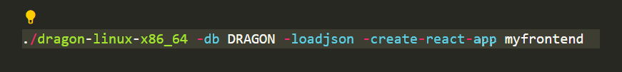
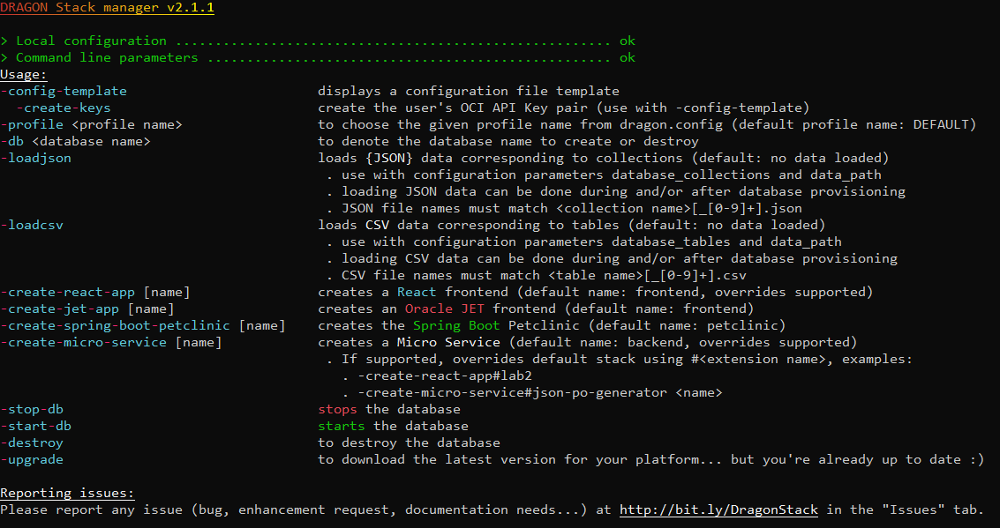
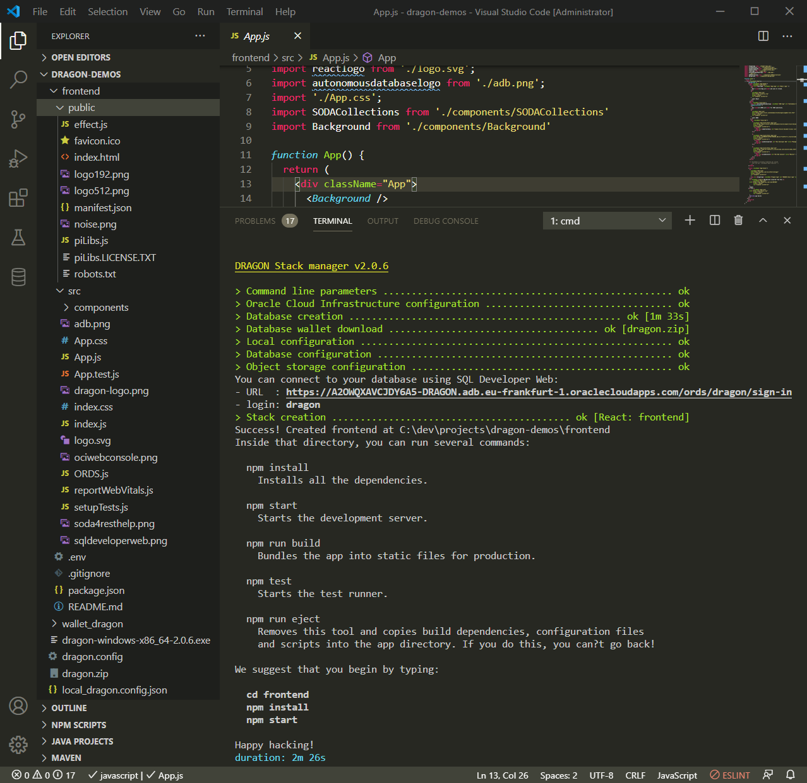
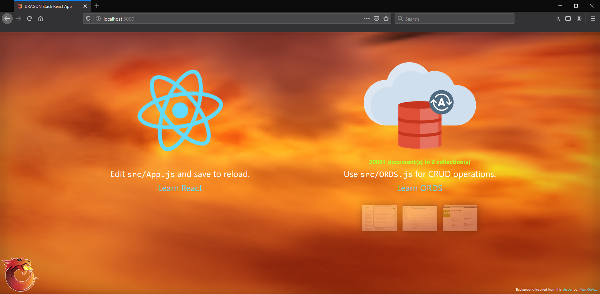
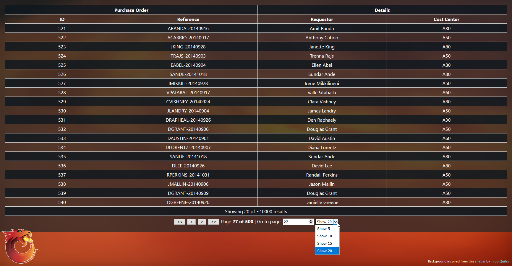
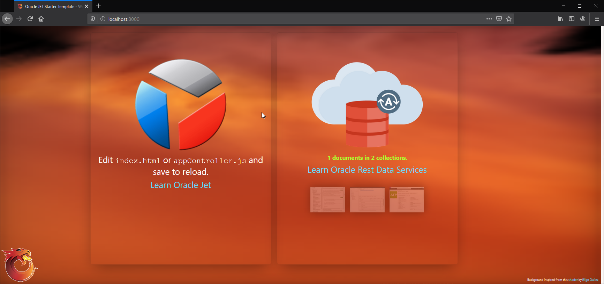

# From Zero to WOW in 5 minutes

- Generates the source code for a _pre-configured_ [REACT](https://reactjs.org/) frontend, [JET](https://www.oracle.com/webfolder/technetwork/jet/index.html) frontend, or for the [Spring-Boot](https://spring.io/projects/spring-boot) Petclinic web application 
- Provisions an autonomous backend ([Always Free autonomous database](#why-autonomous-database-for-developers) + REST Data Services)
- (optional) Loads your JSON data into your collection(s)
- (optional) Loads your CSV data into your table(s)

__... in 5 minutes.__

      

# 30 seconds installation steps

- Download [Linux x86 and OCI Cloud Shell](#linux-and-oci-cloud-shell) | [Linux ARM](#linux-arm) | [Windows](#windows) | [MAC OS](#mac-os)
- [Configure](#configure)
- [Run](#run)
- [Managed Stacks](#stacks)


[Youtube! overview](https://www.youtube.com/watch?v=DzI9yyAiRjY)

## Download
The latest stable release is v2.1.1.

### Linux and OCI Cloud Shell
```
rm -f ./dragon-linux-x86_64-2.1.1
wget https://github.com/loiclefevre/dragon/releases/download/v2.1.1/dragon-linux-x86_64-2.1.1
chmod +x dragon-linux-*
```
Learn about [OCI Cloud shell](https://docs.cloud.oracle.com/en-us/iaas/Content/API/Concepts/cloudshellintro.htm).

### Linux ARM
```
rm -f ./dragon-linux-aarch_64-2.1.1
wget https://github.com/loiclefevre/dragon/releases/download/v2.1.1/dragon-linux-aarch_64-2.1.1
chmod +x dragon-linux-*
```
Learn about [Always Free cloud services](https://www.oracle.com/cloud/free/) now including free ARM Ampere A1 Compute shapes (up to 4 cores and up to 24 GB or RAM).

### Windows
```
powershell wget https://github.com/loiclefevre/dragon/releases/download/v2.1.1/dragon-windows-x86_64-2.1.1.exe -OutFile dragon-windows-x86_64-2.1.1.exe
```
### MAC OS
*You'd need to [notarize](https://developer.apple.com/documentation/xcode/notarizing_macos_software_before_distribution) the application once downloaded*
```
curl -L -O https://github.com/loiclefevre/dragon/releases/download/v2.1.1/dragon-osx-x86_64-2.1.1
chmod +x dragon-osx-*
sudo xattr -r -d com.apple.quarantine dragon-osx-x86_64-2.1.1
```

### Getting Started
To get started, you can go through the [DRAGON LiveLabs](https://apexapps.oracle.com/pls/apex/f?p=133%3A100%3A18510335025442%3A%3A%3A%3ASEARCH%3ADRAGON).

### Changelog
See the changelog [here](./CHANGELOG.md).

## Configure

The DRAGON Stack manager is driven by the command line arguments and the configuration file named *dragon.config* present in your __current directory__:

### CLI arguments



### Configuration file

If no *dragon.config* exist in the __current directory__, then by running the dragon stack CLI, you get a default configuration template to complete and write into the file *dragon.config*. It includes various links to Oracle Cloud Infrastructure documentation to get you started.

__REMARK__: Please notice that (as of now) only __one database__ can be provisioned for a given dragon.config file and hence for a given directory.

_New with v2.0.4_, using the __-create-keys__ parameter along the __-config-template__ command makes the whole process of generating API Keys pair a non-event!  

```
 # DEFAULT profile (case sensitive), you can define others: ASHBURN_REGION or TEST_ENVIRONMENT
 # You can choose a profile using the -profile command line argument
 # WARNING: any property not defined inside the selected profile will use the one from the DEFAULT profile 
 #          if found, hence the name of the profile: DEFAULT :) 
[DEFAULT]

 # OCID of the user connecting to Oracle Cloud Infrastructure APIs. To get the value, see:
 # https://docs.cloud.oracle.com/en-us/iaas/Content/API/Concepts/apisigningkey.htm#five
user=ocid1.user.oc1..<unique_ID>

 # Full path and filename of the SSH private key (use *solely* forward slashes).
 # /!\ Warning: The key pair must be in PEM format. For instructions on generating a key pair in PEM format, see:
 # https://docs.cloud.oracle.com/en-us/iaas/Content/API/Concepts/apisigningkey.htm#Required_Keys_and_OCIDs
key_file=<full path to SSH private key file>

 # Uncomment in the case your SSH private key needs a pass phrase.
# pass_phrase=<pass phrase to use with your SSH private key>

 # Fingerprint for the SSH *public* key that was added to the user mentioned above. To get the value, see:
 # https://docs.cloud.oracle.com/en-us/iaas/Content/API/Concepts/apisigningkey.htm#four
fingerprint=<fingerprint associated with the corresponding SSH *public* key>

 # OCID of your tenancy. To get the value, see:
 # https://docs.cloud.oracle.com/en-us/iaas/Content/API/Concepts/apisigningkey.htm#five
tenancy=ocid1.tenancy.oc1..<unique_ID>

 # An Oracle Cloud Infrastructure region identifier. For a list of possible region identifiers, check here:
 # https://docs.cloud.oracle.com/en-us/iaas/Content/General/Concepts/regions.htm#top
region=eu-frankfurt-1

 # OCID of the compartment to use for resources creation. to get more information about compartments, see:
 # https://docs.cloud.oracle.com/en-us/iaas/Content/Identity/Tasks/managingcompartments.htm?Highlight=compartment%20ocid#Managing_Compartments
compartment_id=ocid1.compartment.oc1..<unique_ID>

 # Authentication token that will be used for OCI Object Storage configuration, see:
 # https://docs.cloud.oracle.com/en-us/iaas/Content/Registry/Tasks/registrygettingauthtoken.htm?Highlight=user%20auth%20tokens
auth_token=<authentication token>

 # Autonomous Database Type:
 # - atpfree: Always Free Autonomous Transaction Processing (default)
 # - ajdfree : Always Free Autonomous JSON Database
 # - apexfree: Always Free Autonomous Application Express
 # - adwfree: Always Free Autonomous Data Warehouse
 # - atp     : Autonomous Transaction Processing
 # - ajd     : Autonomous JSON Database
 # - apex    : Autonomous Application Express
 # - adw     : Autonomous Data Warehouse
# database_type=atpfree

 # Uncomment to specify another database user name than dragon (default)
# database_user_name=<your database user name>

 # The database password used for database creation and dragon user
 # - 12 chars minimum and 30 chars maximum
 # - can't contain the "dragon" word
 # - contains 1 digit minimum
 # - contains 1 lower case char
 # - contains 1 upper case char
database_password=<database password>

 # Uncomment to ask for Bring Your Own Licenses model (doesn't work for Always Free and AJD)
# database_license_type=byol

 # Path to a folder where data to load into collections can be found (default to current directory)
data_path=.

 # A list of coma separated JSON collection name(s) that you wish to get right after database creation
# database_collections=

 # A list of coma separated table name(s) that you wish to get right after database creation
 # These table must have corresponding CSV file(s) so that table structure (DDL) is deduced from the files
# database_tables=
```


## Run

Example from OCI Cloud Shell (Linux):


*(you must have a valid dragon.config file in the current directory)*

Linux and OCI Cloud Shell:
```
$ ./dragon-linux-x86_64-2.1.1
```

Windows:
```
> dragon-windows-x86_64-2.1.1.exe
```

MAC OS:
```
$ ./dragon-osx-x86_64-2.1.1
```

### Oracle Cloud Infrastructure Policy

In order for the DRAGON Stack manager to be able to do its job, an OCI Policy must be set if you are __not__ the administrator of the cloud tenant. If you are using an OCI user who has admin privileges (belongs to group _OCI Administrators_), then no additional configuration is required. If you don't belong to the _OCI Administrators_ group, then ask your admin to create the following policy (for the compartment /demos/json) and make you belong to the associated group:

```
Allow group DRAGON_Stack_Developers to manage buckets in compartment demos:json
Allow group DRAGON_Stack_Developers to manage objects in compartment demos:json
Allow group DRAGON_Stack_Developers to manage autonomous-database-family in compartment demos:json
Allow group DRAGON_Stack_Developers to read resource-availability in compartment demos:json
Allow group DRAGON_Stack_Developers to use cloud-shell in tenancy
```

Eventually, you may ask for some quota to be set on your compartment as well.

### Loading JSON data

If you need to create JSON collections during the provisioning process, you may use the configuration file parameter __database_collections__ (see hereunder). If you also need to load existing JSON data into these collections, you may put your JSON documents in files having the same name as the collection name plus the .json extension. These files must be of JSON dump format with exactly one JSON document per line. No array, no comma separating the documents but carriage returns! __Your files will be loaded only if you ask for it using the -loadjson CLI argument__.  

To load JSON data as well as provisioning (Linux and OCI Cloud Shell):
```
$ ./dragon-linux-x86_64-2.1.1 -loadjson
```

To load JSON data as well as provisioning and finally create a React application (Linux and OCI Cloud Shell):
```
$ ./dragon-linux-x86_64-2.1.1 -loadjson -create-react-app myfrontend
```

### Loading CSV data

If you need to load CSV data into tables during the provisioning process (or even after), you can use the configuration file parameter __database_tables__ (see hereunder). You'll list the names (without file extension, separated by a comma) of CSV files present in the data_path directory (current directory by default). These files __must__ have a header! __Your CSV files will be loaded only if you ask for it using the -loadcsv CLI argument__. In the targeted table doesn't exist, it will be created and its structure will be deduced from the CSV data automatically.  

To load CSV data as well as provisioning (Linux and OCI Cloud Shell):
```
$ ./dragon-linux-x86_64-2.1.1 -loadcsv
```

To load CSV data as well as provisioning and finally create a React application (Linux and OCI Cloud Shell):
```
$ ./dragon-linux-x86_64-2.1.1 -loadcsv -create-react-app myfrontend
```

### Destroying your database

To destroy your database (Linux and OCI Cloud Shell):
```
$ ./dragon-linux-x86_64-2.1.1 -destroy
```

## Stacks

DRAGON Stack manager as its name implies is able to deploy complete Stacks. These stacks contain the database as well as **application source code**.

The following **application examples** are supported:
- [React frontend](#react-frontend) connected to the database using API endpoints
- [Oracle JET frontend](#oracle-javascript-extension-toolkit-frontend) connected to the database using API endpoints
- [Spring-Boot petclinic webapp](#spring-boot-petclinic-webapp) connected to the database using JDBC API
- [Micro-Service backend](#micro-service-backend) to override specifically with prebuilt templates

### React frontend

As of v2.0.1, DRAGON can now generate stacks. The very first stack proposed is a [React](https://reactjs.org/) frontend.



Giving this result in your browser:



#### Accessing ports on OCI Cloud Shell

For OCI Cloud Shell, you may use NGROK (free version) to allow access to your website deployed locally.

```
wget https://bin.equinox.io/c/4VmDzA7iaHb/ngrok-stable-linux-amd64.zip

unzip ngrok-stable-linux-amd64.zip

npm start &
```

For [React](https://reactjs.org/) frontend:
```
./ngrok http 3000
``` 

#### Overriding this stack
Over time, additional templates are being released to improve the existing base stacks. These _overrides_ can be discovered in the [stacks](./stacks/) folder.

```
$ ./dragon-linux-x86_64-2.1.1 -create-react-app#lab2 myfrontend
```

The [lab2](./stacks/create-react-app/lab2) for example extends the default [React](https://reactjs.org/) frontend stack with a [React-Table](https://react-table.tanstack.com/):



### Oracle JavaScript Extension Toolkit frontend

As of v2.1.0, DRAGON can now generate [Oracle JET](https://www.oracle.com/webfolder/technetwork/jet/index.html) stacks. 
Thanks a lot to [Paolo Bellardone](https://github.com/paolobellardone) for doing this integration inside DRAGON!    

Giving this result in your browser:



#### Accessing ports on OCI Cloud Shell

For OCI Cloud Shell, you may use NGROK (free version) to allow access to your website deployed locally.

```
wget https://bin.equinox.io/c/4VmDzA7iaHb/ngrok-stable-linux-amd64.zip

unzip ngrok-stable-linux-amd64.zip

npm start &
```

For [Oracle JET](https://www.oracle.com/webfolder/technetwork/jet/index.html) frontend:
```
./ngrok http 8000
``` 

### Spring-Boot petclinic webapp

As of v2.0.3, DRAGON can now generate a [Spring-Boot](https://spring.io/projects/spring-boot) based stack including the well known petclinic web application.


#### Accessing ports on OCI Cloud Shell

For OCI Cloud Shell, you may use NGROK (free version) to allow access to your web application deployed locally.

```
wget https://bin.equinox.io/c/4VmDzA7iaHb/ngrok-stable-linux-amd64.zip

unzip ngrok-stable-linux-amd64.zip

java -jar target/*.jar &
```

For [Spring-Boot](https://spring.io/projects/spring-boot) web application:
```
./ngrok http 8080
``` 

### Micro-Service backend

**Micro**-service backend can now be deployed using the DRAGON Stack manager. Because of the relative complexity of such eco-system, DRAGON will not come with default microservice templates but instead provide, through its **override** mechanism,
a set of [templates](./stacks/create-micro-service/).

```
$ ./dragon-linux-x86_64-2.1.1 -create-micro-service#json-po-generator
```

Running this command will provide you a simple micro-service that can be used for demoing JSON data ingestion in Oracle Autonomous databases using the Simple Oracle Document Access API.   

## Why Autonomous Database for Developers?

Simple to use, it works, it is optimized already, __no__ administrative burdens, develop right away!

__[Converged](https://www.youtube.com/watch?v=yBWgb_oh39U)__, it means, you get the consistency of a _relational_ database, the _flexibility_ of a JSON database, the simplicity of _Machine Learning_ in the database, the location capabilities of a _spatial_ database, the power of a property _graph_ database, the indexing capabilities of a _full-text_ database, the _automatic elasticity_ as well as the costing model (always free version, pay by the second...) of a cloud native database, the _performance_ of the underlying infrastructure Exadata, the strongest _security_ of the database market, and the vast developer friendly ecosystem brought by Oracle Cloud Infrastructure.

 
Autonomous Database can be:
 - __[Always Free](https://signup.oraclecloud.com/?language=en)__ Autonomous Transaction Processing (ATP, aka Converged Database)
 - __[Always Free](https://signup.oraclecloud.com/?language=en)__ Autonomous JSON Database (AJP, same as ATP 25% the price in case you upgrade to the paid version and limited to 20 GB of relational data)
 - __[Always Free](https://signup.oraclecloud.com/?language=en)__ Autonomous Application Express (APEX, the Low-Code application development environment)
 - __[Always Free](https://signup.oraclecloud.com/?language=en)__ Autonomous Data Warehouse (ADW)
 - Autonomous Transaction Processing (ATP)
 - Autonomous JSON Database (AJD)
 - Autonomous Application Express (APEX)
 - Autonomous Data Warehouse


### Thanks
I would like to thank the people that contributed to this project:
- [Paolo Bellardone](https://github.com/paolobellardone): for building the MAC OS native image, for integrating Oracle JET inside DRAGON (and of course testing and reporting bugs)
- [Manu M.](https://github.com/mmanu-gh), and [Davide Burdese](https://github.com/davideburdese): for testing and reporting bugs
- [Jon Russel](https://github.com/jon-russell): for creating the DRAGON logo :)
- [Kay Malcolm](https://github.com/kaymalcolm), [T. McGinn](https://github.com/tmcginn), and [Kamryn V.](https://github.com/kamryn-v): for the energy, the motivation and the Live Labs!!! :)

### GraalVM Native Image Compression
You can get more information in my [post on the GraalVM blog](https://medium.com/graalvm/compressed-graalvm-native-images-4d233766a214):


