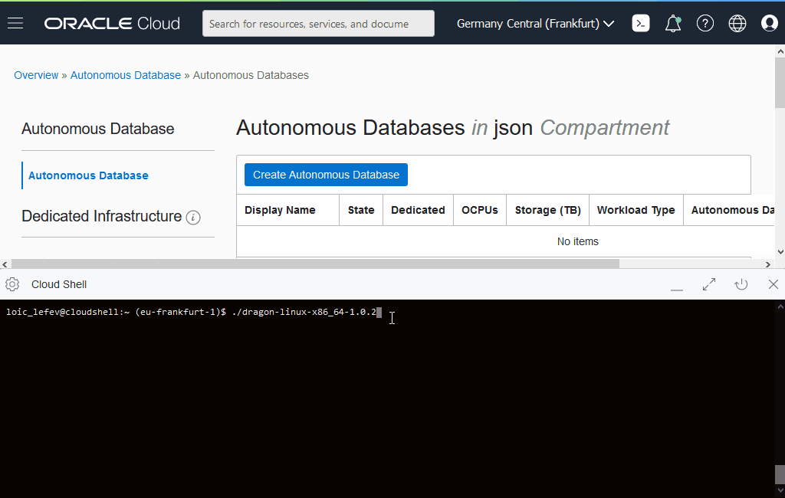

# From Zero to WOW in 5 minutes
This project aims to bring unprecedented user experience to developers by __simplifying__ the deployment of applications using an [Autonomous Database](#why-oracle-autonomous-database-for-developers). 

# 30 seconds installation steps

- [Download](#download)
- [Configure](#configure)
- [Run](#run)
- [Managed Stacks](#stacks)

[](https://www.youtube.com/watch?v=X-10r-zji9E)

## Download
The latest stable release is v2.0.0.

Linux and [Oracle Cloud Infrastructure Cloud Shell](https://docs.cloud.oracle.com/en-us/iaas/Content/API/Concepts/cloudshellintro.htm):
```
rm -f ./dragon-linux-x86_64-2.0.0
wget https://github.com/loiclefevre/dragon/releases/download/v2.0.0/dragon-linux-x86_64-2.0.0
chmod +x dragon-linux-*
```
Windows:
```
powershell wget https://github.com/loiclefevre/dragon/releases/download/v2.0.0/dragon-windows-x86_64-2.0.0.exe -OutFile dragon-windows-x86_64-2.0.0.exe
```
MAC OS:
```
curl -L -O https://github.com/loiclefevre/dragon/releases/download/v2.0.0/dragon-osx-x86_64-2.0.0
chmod +x dragon-osx-*
```

## Configure

The DRAGON Stack is driven by the command line arguments and a configuration file named *dragon.config*:

### CLI arguments

```
./dragon-linux-x86_64-2.0.0 -help
DRAGON Stack manager v2.0.0

> Command line parameters ................................................... ok
Usage:
  -config-template              display a configuration file template
  -profile <profile name>       choose the given profile name from dragon.config (instead of DEFAULT)
  -db <database name>           denotes the database name to create
  -load                         load corresponding data into collections
  -create-react-app [name]      create a React frontend (default project name is "frontend")
  -destroy                      ask to destroy the database
```

If you wish to create JSON collections during the provisioning process, you may use the configuration file parameter __database_collections__ (see hereunder). If you also wish to load existing data into these collections, you may put your JSON documents in files having the same name as the collection name plus the .json extension. These files must be of JSON dump format with exactly one JSON document per line. No array, no comma separating the documents but carriage returns! __Your files will be loaded only if you ask for it using the -load CLI argument__.  

### Configuration file

If no *dragon.config* exist in the current directory, then by running the dragon stack CLI, you get a default configuration template to complete and write into the *dragon.config*. It includes various links to Oracle Cloud Infrastructure documentation to get you started. 

```
 # DEFAULT profile (case sensitive), you can define others: ASHBURN_REGION or TEST_ENVIRONMENT
 # You can choose a profile using the -profile command line argument
[DEFAULT]

 # OCID of the user connecting to Oracle Cloud Infrastructure APIs. To get the value, see:
 # https://docs.cloud.oracle.com/en-us/iaas/Content/API/Concepts/apisigningkey.htm#five
user=ocid1.user.oc1..<unique_ID>

 # Full path and filename of the SSH private key (use *solely* forward slashes).
 # /!\ Warning: The key pair must be in PEM format. For instructions on generating a key pair in PEM format, see:
 # https://docs.cloud.oracle.com/en-us/iaas/Content/API/Concepts/apisigningkey.htm#Required_Keys_and_OCIDs
key_file=<full path to SSH private key file>

 # Fingerprint for the SSH *public* key that was added to the user mentioned above. To get the value, see:
 # https://docs.cloud.oracle.com/en-us/iaas/Content/API/Concepts/apisigningkey.htm#four
fingerprint=<fingerprint associated with the corresponding SSH *public* key>

 # OCID of your tenancy. To get the value, see:
 # https://docs.cloud.oracle.com/en-us/iaas/Content/API/Concepts/apisigningkey.htm#five
tenancy=ocid1.tenancy.oc1..<unique_ID>

 # An Oracle Cloud Infrastructure region identifier. For a list of possible region identifiers, check here:
 # https://docs.cloud.oracle.com/en-us/iaas/Content/General/Concepts/regions.htm#top
region=eu-frankfurt-1

 # OCID of the compartment to use for resources creation. to get more information about compartments, see:
 # https://docs.cloud.oracle.com/en-us/iaas/Content/Identity/Tasks/managingcompartments.htm?Highlight=compartment%20ocid#Managing_Compartments
compartment_id=ocid1.compartment.oc1..<unique_ID>

 # Authentication token that will be used for OCI Object Storage configuration, see:
 # https://docs.cloud.oracle.com/en-us/iaas/Content/Registry/Tasks/registrygettingauthtoken.htm?Highlight=user%20auth%20tokens
auth_token=<authentication token>

 # Autonomous Database Type: ajd (for Autonomous JSON Database), atp (for Autonomous Transaction Processing), adw (for Autonomous Data Warehouse)
 # Empty value means Always Free Autonomous Transaction Processing.
# database_type=

 # Uncomment to specify another database user name than dragon (default)
# database_user_name=<your database user name>

 # The database password used for database creation and dragon user
 # - 12 chars minimum and 30 chars maximum
 # - can't contain the "dragon" word
 # - contains 1 digit minimum
 # - contains 1 lower case char
 # - contains 1 upper case char
database_password=<database password>

 # Uncomment to ask for Bring Your Own Licenses model (doesn't work for Always Free and AJD)
# database_license_type=byol

 # A list of coma separated JSON collection name(s) that you wish to get right after database creation
# database_collections=

 # Path to a folder where data to load into collections can be found (default to current directory)
data_path=.
```


## Run

Example from OCI Cloud Shell (Linux):



*(you must have a valid dragon.config file in the current directory)*

Linux and OCI Cloud Shell:
```
$ ./dragon-linux-x86_64-2.0.0
```

To load data as well as provisioning (Linux and OCI Cloud Shell):
```
$ ./dragon-linux-x86_64-2.0.0 -load
```

To load data as well as provisioning and finally create a React application (Linux and OCI Cloud Shell):
```
$ ./dragon-linux-x86_64-2.0.0 -load -create-react-app myfrontend
```

Windows:
```
> dragon-windows-x86_64-2.0.0.exe
```

MAC OS:
```
$ ./dragon-osx-x86_64-2.0.0
```

To destroy your database (Linux and OCI Cloud Shell):
```
$ ./dragon-linux-x86_64-2.0.0 -destroy
```

## Stacks

As of v2.0.0, DRAGON can now generate stacks. The very first stack proposed is a [React](https://reactjs.org/) frontend.

### OCI Cloud Shell (Linux)

For OCI Cloud Shell, you may use NGROK (free version) to allow access to your website deployed locally.

```
wget https://bin.equinox.io/c/4VmDzA7iaHb/ngrok-stable-linux-amd64.zip

unzip ngrok-stable-linux-amd64.zip

npm start &

./ngrok http 3000
``` 

## Why Oracle Autonomous Database* for Developers?

Simple to use, it works, it is optimized already, __no__ administrative burdens, develop right away!

Converged, it means, you get the consistency of a _relational_ database, the _flexibility_ of a JSON database, the simplicity of _Machine Learning_ in the database, the location capabilities of a _spatial_ database, the power of a property _graph_ database, the indexing capabilities of a _full-text_ database, the _automatic elasticity_ as well as the costing model (always free version, pay by the second...) of a cloud native database, the _performance_ of the underlying infrastructure Exadata, the strongest _security_ of the database market, and the vast developer friendly ecosystem brought by Oracle Cloud Infrastructure.

 
 \* Autonomous Database can be:
 - __Always Free__ Autonomous Transaction Processing (ATP, aka Converged Database)
 - Autonomous JSON Database (AJD)
 - Autonomous Transaction Processing (ATP)
 - Autonomous Data Warehouse (ADW)


### Thanks
I would like to thank the people that contributed to this project:
- [Paolo Bellardone](https://github.com/paolobellardone): for building the MAC OS native image (and of course testing and reporting bugs)
- [Manu M.](https://github.com/mmanu-gh), and [Davide Burdese](https://github.com/davideburdese): for testing and reporting bugs
- [Jon Russel](https://github.com/jon-russell): for creating the DRAGON logo :)
- [Kay Malcolm](https://github.com/kaymalcolm), [T. McGinn](https://github.com/tmcginn), and [Kamryn V.](https://github.com/kamryn-v): for the energy, the motivation and the Live Labs!!! :) 
